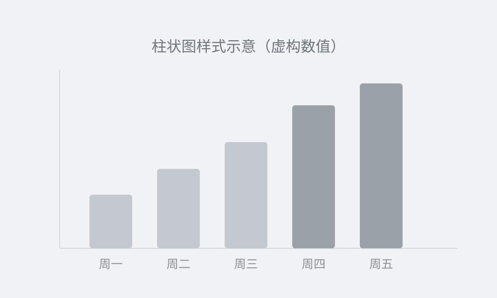

# 先把文章读清楚，再比较版式

> 这是一份排版演示稿，不是真实运营案例。文字、图片与表格用于比较样式，不代表阅读量或转化效果。

挑模板之前，先说清楚文章帮助谁完成什么任务。教程需要清楚的步骤，读书笔记需要连贯的段落，品牌故事需要让图片与叙述相互配合。

比较版式时，**保持原文不变**。先观察标题是否醒目、列表是否好找，再决定颜色与装饰是否适合内容。

## 先检查三个排版要素

- **行高**：相邻两行是否容易分辨，读到下一行时是否会找错位置。
- **段间距**：不同段落是否分得开，同一主题是否被切得太碎。
- **左右留白**：正文是否贴边，长标题与表格是否需要调整。

下面是供试排版的示例参数，不是对真实账号的测量，也不是通用标准：

| 示例方案 | 字号 | 行高 | 段间距 |
|------|------|------|--------|
| 方案 A | 16px | 1.8 | 24px |
| 方案 B | 16px | 1.95 | 28px |
| 方案 C | 15px | 2.0 | 26px |

只改变一个参数，更容易看出差异。**最终选择要回到自己的文章和手机预览**，而不是把一组数字当成效果保证。

> 好的版式让读者更容易找到信息。

## 三种值得留意的情况

### 一、电脑和手机的行宽不同

电脑上的一行很长，手机上的一行较短。同一段文字放到不同宽度，会出现不同的折行；长标题尤其需要检查。

### 二、强调太多，重点反而难找

先选出真正需要扫读的词句。如果每一句都加粗或换色，可以试着减少强调，再通读一次。

### 三、把完整意思拆得太碎

段落应跟着内容组织，不必每句单独成段。一个完整的解释可以保留在同一段里，再通过小标题划分主题。

## 用自己的旧稿做一次对照

1. 选择一篇有标题、列表、图片和表格的旧稿。
2. 保持文字不变，试两种模板，并在手机上比较。
3. 选定后保存风格，后续文章复用并按内容微调。

还不确定模板用途，可以看[模板选择指南](https://aiworkskills.cn/guides/wechat-formatting.html)。需要检查导出的样式时，也可以打开 `article.html` 对照预览。

### 发文前检查

- [x] 已区分演示内容与真实案例
- [x] 标题层级清楚
- [ ] 图片、图注和正文对应
- [ ] 已在微信里检查表格与长标题

---

模板帮助统一视觉。**事实、表达与读者需求仍需逐篇检查**，这份演示不承诺阅读或转化提升。
